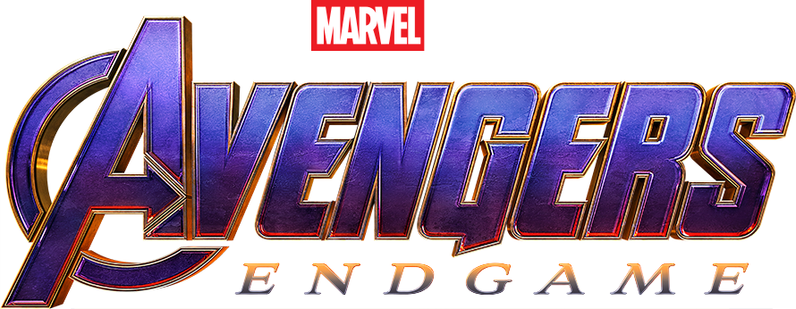
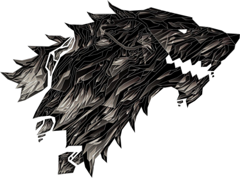

##  Avengers: Endgame &  GoT Spoilers Hider - Chrome Extension 
Hides all the GOT Spoilers

# How To Use?
- Clone this repository(using git) or download as a zip file
- Incase you downloaded as a zip, unzip it
- Open Google Chrome
- Go to `chrome://extensions`
- Click on `Load Unpacked` which you can see in the top left side.
- Select the path where you cloned/downloaded this project.
- An icon  should appear besides your Chrome Search bar.
- That's all :D. You're GOT will not be spoiled now.
